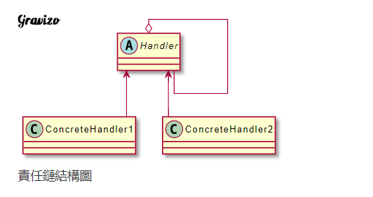
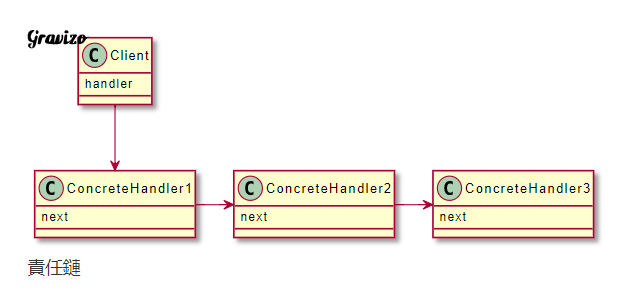

# 將多個物件連成一條鏈，沿著這條鏈傳遞至每一個物件並處理請求。

將多個物件連成一條鏈，沿著這條鏈傳遞至每一個物件並處理請求，當這個物件沒有處理的權限時，能夠將這個請求，傳遞給下一個物件繼續處理。

---

| 成員            | 功用                                                                          |
|-----------------|-------------------------------------------------------------------------------|
| Handler         | 定義一個處理請求的接口，包含抽象處理方法及後續方法。                          |
| ConcreteHandler | 實作Handler的處理方法，判斷是否可以處理這次的請求，可以則處理，不行則往後傳。 |

Handler：定義一個處理請求的接口，包含抽象處理方法及後續方法。
ConcreteHandler：實作Handler的處理方法，判斷是否可以處理這次的請求，可以則處理，不行則往後傳。

