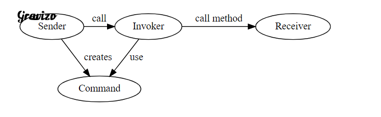
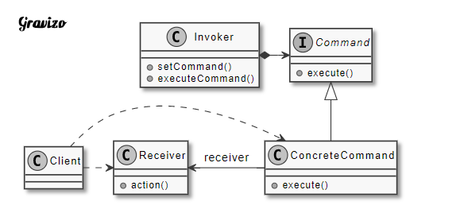

#請求以命令的形式封裝在物件中，並傳給調用對象。調用對象尋找可處理該命令的適合對象，並將命令傳給合適的對象執行

當Ａ要請求Ｂ執行任務時，Ａ會呼叫Ｂ然後Ｂ在完成任務，在這種情況下Ａ需直接和Ｂ進行溝通，就像Ａ是老闆，他要交代員工Ｂ去做事情一樣，如下圖。我們稱做Ａ為Sender，Ｂ為Reciver。

但如果Sander需要Reciver做很多事怎麼辦？就像是老闆非常忙碌，他沒辦法提醒每個人該做什麼事情，那該怎麼辦？這時老闆可以使用備忘錄。他將任務寫在備忘錄上，再經由秘書把任務交給員工完成。

老闆(Sender)將任務封裝成備忘錄(Command)，然後秘書(Invoker)再經由備忘錄的工作事項分派任務給員工(Receiver)。如此一來老闆不需要知道是哪個員工執行，只需要秘書回報任務結果即可

| 成員             | 功用                                                                                |
|------------------|-------------------------------------------------------------------------------------|
| Command          | 用來宣告執行操作的interface / abstract class。                                      |
| ConcreteCommand  | Command的實體物件，通常會持有Receiver，並呼叫Receiver的功能來完成命令要執行的操作。 |
| Receiver(接收者) | 幹活的角色， 命令傳遞到被執行。                                                     |
| Invoker(請求者)  | 接收並要求執行命令。                                                                |
| Client(裝配者)   | 建立Command Object，組裝Command Object和Receiver                                    |

Command: 用來宣告執行操作的interface / abstract class。
ConcreteCommand: Command的實體物件，持有並呼叫Receiver執行的操作。
Receiver: 執行命令。
Invoker: 接收並要求執行命令。
Client: 建立Command Object，組裝Command Object和Receiver

