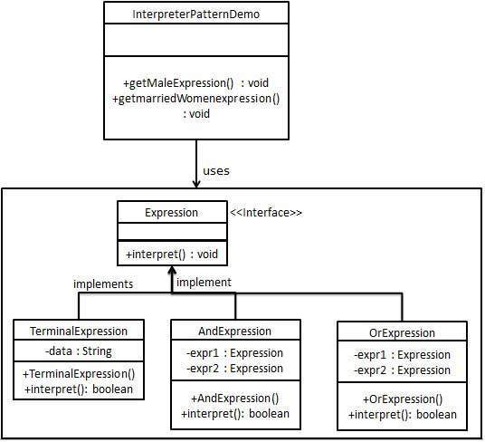

# 這種模式實現了一個表示式介面，該介面解釋一個特定的上下文。這種模式被用在 SQL 解析、符號處理引擎等

把一句有特殊規則的語句，透過解釋器將它真正的意思表現出來

- Context 通常是指待解譯的語句
- AbstractExpression 是所有規則都要實作的介面
- TerminalExpression 是指無法再展開的規則，算是最小單位的規則
- NonterminalExpression 是指可以再展開的規則，可以展開成 NonterninalExpression 和 TerminalExpression 的組合

