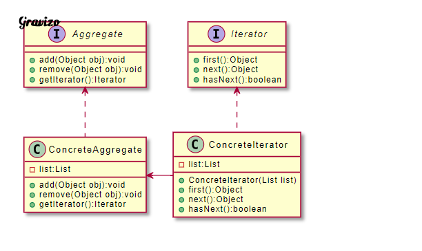

# 提供一種方法可以順序性讀取一個集合物件中的各個元素，而又不會暴露該物件的內部表示

| 成員              | 功用                                                                      |
|-------------------|---------------------------------------------------------------------------|
| Aggregate         | 定義新增、儲存、刪除集合物件及建立迭代器物件的接口。                      |
| ConcreteAggregate | 實作Aggregate，回傳一個迭代器的實體。                                     |
| Iterator          | 定義呼叫及遍歷集合元素的接口，通常包含hasNext()、first()、next() 等方法。 |
| Concretelterator  | 實現Iterator所定義的方法，完成集合物件的遍歷及記錄當前的位置。            |

Aggregate：定義新增、儲存、刪除集合物件及建立迭代器物件的接口。
ConcreteAggregate：實作Aggregate，回傳一個迭代器的實體。
Iterator：定義呼叫及遍歷集合元素的接口，通常包含hasNext()、first()、next() 等方法。
Concretelterator：實現Iterator所定義的方法，完成集合物件的遍歷及記錄當前的位置。

