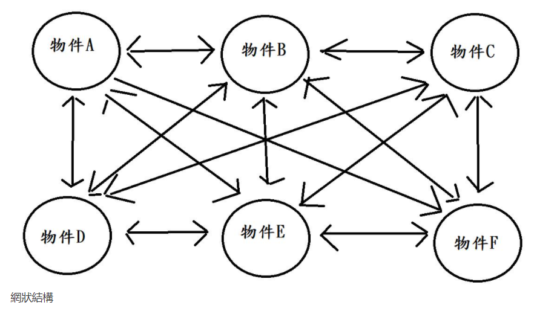
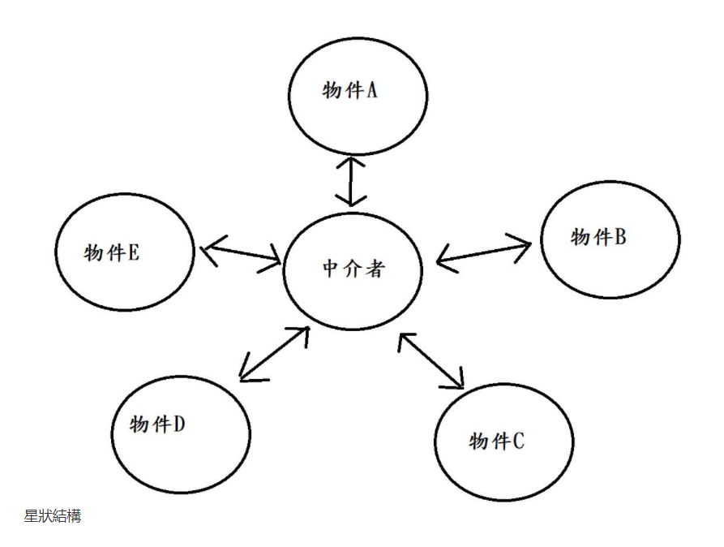
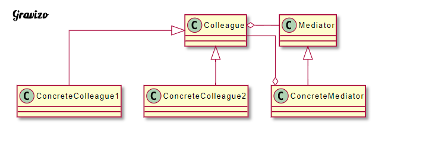

# 定義一個 Mediator 物件用來封裝一組物件的互動方式。Mediator 藉由避免物件間相互直接的引用，從而降低它們之間的耦合程度，並且可以讓我們獨立地改變這些物件間的互動方式
定義一個中介者物件來處理其餘物件的互動，藉此降低物件之間的耦合性。

在生活上有許多事情會有複雜的關係，例如一間軟體公司產品，需要開發團隊、設計團隊、行銷團隊、客服團隊等等才能有一個較完善的產品團隊。而開發跟設計可能需要協調產品頁面，行銷也要跟開發討論產品功能如何符合市場，客服也會跟設計反應哪些流程需要改善。如此一來團隊之間的關係就會非常的複雜，如下圖：

每個團隊自己去跟不同團隊有關係，我們稱這結構叫網狀結構

但很明顯這樣的一個結夠並不是很理想，所以產品需要一個產品經理，也就是中介者。由產品經理來處理所有團隊的，結構就會變成下圖：

這種結構稱作星狀結構，現在每個團隊都經由產品經理去跟其他團隊溝通，團隊間的相依性就降低了許多。

| 成員              | 功用                                                                                           |
|-------------------|------------------------------------------------------------------------------------------------|
| Mediator          | 抽象中介者。主要為中介者接口，提供同事物件方法。                                               |
| ConcreteMediator  | 實體中介者。實作抽象中介者，定義一個集合來管理同事物件，處理各同事間的關係，所以她依賴於同事。 |
| Colleague         | 抽象同事類。定義同事類別的接口，保存中介者物件，提供同事物件抽象方法。                         |
| ConcreteColleague | 實體同事類。實作抽象同事，當需要與其他同事物件工作時，需要由中介者物件負責後續的接洽。         |

Mediator：抽象中介者。主要為中介者接口，提供同事物件方法。
ConcreteMediator：實體中介者。實作抽象中介者，定義一個集合來管理同事物件，處理個同事間的關係，所以她依賴於同事。
Colleague：抽象同事類。定義同事類別的接口，保存中介者物件，提供同事物件抽象方法。
ConcreteColleague：實體同事類。實作抽象同事，當需要與其他同事物件工作時，需要由中介者物件負責後續的接洽。
