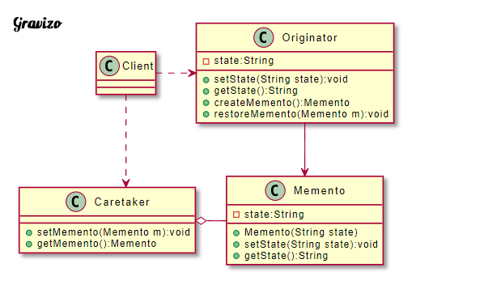

# 在不破壞封裝的前提下，儲存一個物件的某個狀態，以便於需要的時候將物件恢復到原先儲存的狀態

| 成員               | 功用                                                                                 |
|--------------------|--------------------------------------------------------------------------------------|
| Originator(發起人) | 紀錄目前的內部狀態，提供建立備忘錄及回復備忘錄狀態的功能，可以訪問備忘錄內所有訊息。 |
| Memento(備忘錄)    | 保存發起人的內部狀態，在需要的時候提供給發起人。                                     |
| Caretaker(管理者)  | 實現State所定義的方法。                                                              |

Originator(發起人)：紀錄目前的內部狀態，提供建立備忘錄及回復備忘錄狀態的功能，可以訪問備忘錄內所有訊息。
Memento(備忘錄)：保存發起人的內部狀態，在需要的時候提供給發起人。
Caretaker(管理者)：管理、保存及讀取備忘錄的功能，但不能對備忘錄的內容進行訪問及修改。

