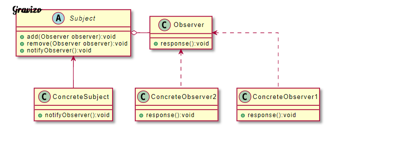

# 多個物件之間存在著一對多的依賴關係，當一個物件發生改變時，所有跟他有關的物件都會被通知且更新

| 成員             | 功用                                                                                                           |
|------------------|----------------------------------------------------------------------------------------------------------------|
| Subject          | 抽象目標，提供保存觀察者物件的集合以及增加觀察者物件的方法、刪除觀察者物件的方法以及通知所有觀察者的抽象方法。 |
| ConcreteSubject  | 具體目標，實作抽象目標中的通知方法。具體目標內部發生改變時會通知所有加入的觀察者物件。                         |
| Observer         | 抽象觀察者，可以是抽象類別或是介面。含有更新自己的抽象方法。                                                   |
| ConcreteObserver | 實作抽象觀察者，在目標更改狀態時接收通知並更改自身狀態。                                                       |

Subject：抽象目標，提供保存觀察者物件的集合以及增加觀察者物件的方法、刪除觀察者物件的方法以及通知所有觀察者的抽象方法。
ConcreteSubject：具體目標，實作抽象目標中的通知方法。具體目標內部發生改變時會通知所有加入的觀察者物件。
Observer：抽象觀察者，可以是抽象類別或是介面。含有更新自己的抽象方法。
ConcreteObserver：實作抽象觀察者，在目標更改狀態時接收通知並更改自身狀態。

