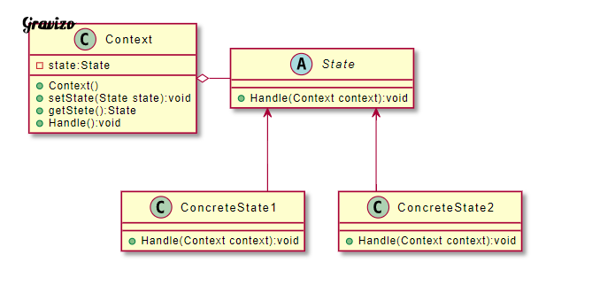

# 有狀態的物件，把複雜的邏輯判斷分配到不同的狀態物件中，允許狀態物件在其內部狀態發生改變時改變行為

| 成員                      | 功用                                                                       |
|---------------------------|----------------------------------------------------------------------------|
| Context（環境）           | 定義Client的接口，維護目前的狀態，並將狀態的操作委託給目前狀態物件來處理。 |
| State（狀態）             | 定義一個接口，用來封裝Context中特定狀態所對應的行為。                      |
| ConcreteState（實體狀態） | 實現State所定義的方法。                                                    |

Context：定義Client的接口，維護目前的狀態，並將狀態的操作委託給目前狀態物件來處理。
State：定義一個接口，用來封裝Context中特定狀態所對應的行為。
ConcreteState：實現State所定義的方法。

