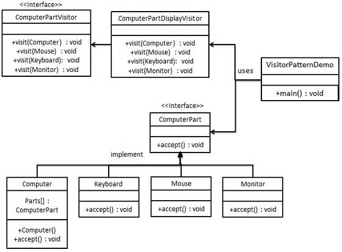

# 將類別的行為和類別切開

Visitor：針對要訪問的元件類別定義一個或多個方法 (以圖來看只有兩個 ConcreteElement，因此一般是定義兩個)。
ConcreteVisitor：可以想成實際上定義了要做什麼事的訪問者。以圖來看，有兩個訪問者，他們都可以訪問到兩個 ConcreteElement，但兩個訪問者要做的事情不同。
Element：讓元件類別實作的介面，定義了一個以 Visitor 當參數的方法。
ConcreteElement：實作 Element 的具象類別，就是我們實際要操作的元件。
ObjectStructure：主要用途是讓訪問者可以尋訪所有元件。以 Java 來說，通常是以 List，Collection 來存元件。

