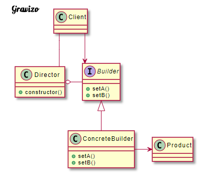

# 把一個複雜物件的建構及其樣貌分離，如此相同的建構過程可以產生不同樣貌的物件

以筆電功能為例，假設我們必定要有: cpu, monitor, memory , keyboard, harddisk

    private String cpu;
    private String monitor;
    private String memory;
    private String keyboard;
    private String harddisk;

原本的建構子:

        public Notebook(String cpu, String monitor, String memory, String keyboard, String harddisk) {
            this.cpu = cpu;
            this.monitor = monitor;
            this.memory = memory;
            this.keyboard = keyboard;
            this.harddisk = harddisk;
        }

但之後陸續又新增了 mouse, hdmi 等兩個功能，因此建構子必須要新增兩種

    public Notebook(String cpu, String monitor, String memory, String keyboard, String harddisk, String hdmi) {
        this.cpu = cpu;
        this.monitor = monitor;
        this.memory = memory;
        this.keyboard = keyboard;
        this.harddisk = harddisk;
        this.hdmi = hdmi;
    }

    public Notebook(String cpu, String monitor, String memory, String keyboard, String harddisk, String mouse, String hdmi) {
        this.cpu = cpu;
        this.monitor = monitor;
        this.memory = memory;
        this.keyboard = keyboard;
        this.harddisk = harddisk;
        this.mouse = mouse;
        this.hdmi = hdmi;
    }

那之後是不是新增功能每次建構子都要新增 ? 可讀性後續擴充性都大大降低了。

Builder Pattern: "把一個複雜物件的建構與樣貌分離，如此相同的建構過程可以產生不同樣貌的物件"

因此接下來我們要將筆電的各個元件(cpu、memory...) 等利用Builder來建立。

###在使用Builder Pattern前，必須先來了解一下他們的成員及功用 

Product: 最終要被建立出來的物件類別。
Builder: 用來定義建構物件過程中各必要步驟（方法）的介面。
ConcreteBuilder: 實作Builder介面，實際用來建構物件的類別。
Director: 負責指揮ConcreteBuilder該如何建構物件。

藉由Builder的介面先定義好組電腦所需要的方法及步驟。ConcreteBuilder實作Builder
，並完成組裝的邏輯。最後經由Director呼叫ConcreteBuilder的實作的組裝步驟來將Product建立出來。

