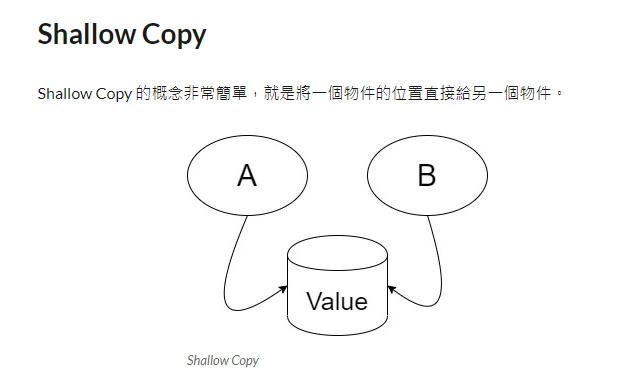
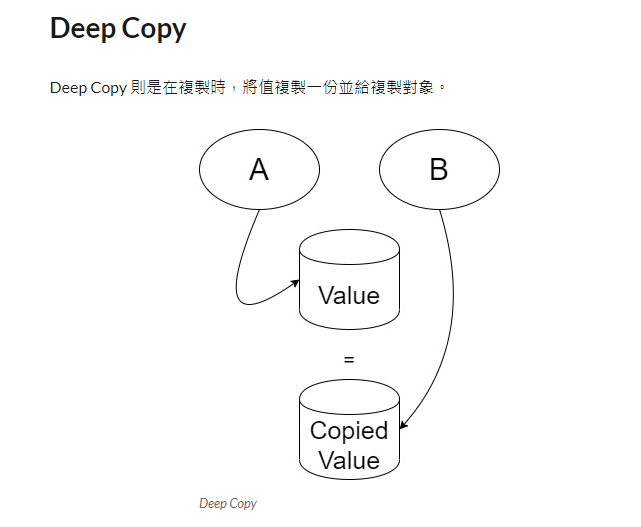

#用原型例項指定建立物件的種類，並且通過拷貝這些原型建立新的物件

| 成員              | 功用                                             |
|-------------------|--------------------------------------------------|
| Prototype         | 定義實體原型物件必須實作的介面。                 |
| ConcretePrototype | 實作抽象介面的clone()方法，為可被複製的對象。    |
| Client            | 使用ConcretePrototype中的clone()來複製新的物件。 |

#淺複製（Shallow copy）
如果原型物件的成員變數為基本資料類型，將複製一份給新的物件；
如果原型物件的成員變數為引用類型，則只將原本的物件位址複製給新的物件。
也就是原型物件和複製物件的成員變數指向相同的内存位址。

意思就是，淺複製中，只複製了自己本身以及基本資料類型的成員，而引用類型的成員並沒有被複製。

兩個物件皆會指到同一個地址下的同一個值，當然當其中一個物件改動其值，另一個也會受到其影響。

---
#深複製（Deep copy） 
如果原型物件的成員變數不管是基本資料類型或是引用類型，都會複製給新的物件。 簡單來說，深複製中，除了自己被複製，所有的變數也被複製給新的物件。

既然都已經複製值到另外的記憶體空間，就不會有一改改全部。