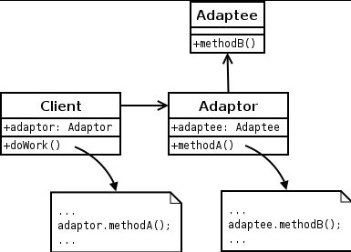
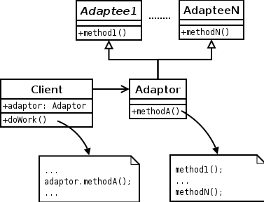

# 將一個類別的介面轉換成客戶希望的另外一個介面，Adapter使得原本由於介面相容而不能一起工作的那些類別可以一起工作

| 成員    | 功用                                                                                                                                                                                                 |
|---------|------------------------------------------------------------------------------------------------------------------------------------------------------------------------------------------------------|
| Target  | 定義所需要的方法，可以是抽象類別或是介面                                                                                                               |
| Adaptee | 為呼叫和配接的元件中的组件接口                                                                                                                         |
| Adapter | 為一個轉換器，通過繼承或是合成的方式，將Adaptee的接口轉換成Adapter接口，Client直接呼叫Adapter接口就可以執行Adaptee的方法 |

#另外會有兩種Adapter: Object Adapter , Class Adapter

---
1. Object Adapter

   from wiki

Target 宣告中繼function
Adaptee 裡面放要另一個介面實作的內容
Adapter 實作Target的介面function

Client 透過Adapter提供的function ，達到轉Call Adaptee 實作內容

---
2. Class Adapter
 from wiki

在Java中必須透過繼承，但Java 沒有多重繼承，因此無法滿足多個Adaptee的功能

