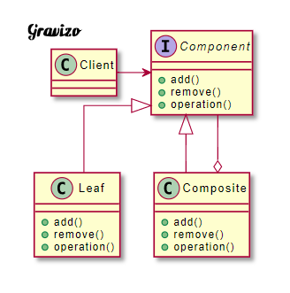
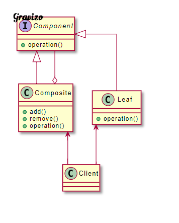

# Composite Pattern使得使用者對單個物件和組合物件的使用具有一致性，所以又稱部分-整體模式 (物件以樹狀結構組合，做為表現出整體-部分的階層關係。)

| 成員               | 功用                                                                                                                       |
|--------------------|----------------------------------------------------------------------------------------------------------------------------|
| Component 抽象構件 | 為組合中的物件宣告介面，在透明式組合模式中可以宣告包括管理子類的方法接口。安全式組合模式中管理子類的方法則由樹枝構件完成。 |
| Leaf 樹葉構件      | 組合中的樹葉節點，沒有子節點。實作Component宣告的接口。                                                                    |
| Composite 樹枝構件 | 組合中的分支節點，有子節點。實作Component宣告的接口。主要作用在於儲存及管理子類物件。通常有add(), remove()等方法。         |

組合模式有兩種，分別是透明式組合模式以及安全式組合模式。

透明式的組合模式
將所有的方法先定義在Component內，如此一來Client不需要區別是Leaf還是Composite，對他來說是透明的。但缺點就是，Leaf並不需要實作add以及remove方法。若這樣的話，勢必只能空實作或是拋錯，這樣會造成一些安全性的疑慮。

安全式的組合模式
將管理子構件的方法移出Component，這樣Component以及Leaf就不會有管理子構件的方法。這樣Leaf就不需要空實作或是拋錯，解決了透明式安全性的疑慮。但由於將方法切開，所以Component與Leaf的接口就會不一樣，Client在呼叫時必須要知道兩者的存在，而失去了透明性。

