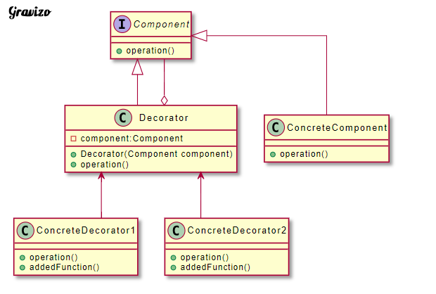

# 裝飾模式動態將責任附加在物件上，若要擴展功能上，裝飾者提供比繼承更有彈性的替代方案。 (動態地給一個物件新增一些額外的職責)

| 成員              | 功用                                                                                             |
|-------------------|--------------------------------------------------------------------------------------------------|
| Component         | 定義一個物件的介面,可以給物件動態增加職責。                                                      |
| ConcreteComponent | 定義一個物件,可以給這個物件增加一些職責。（將ConcreteDecorator裝飾到他身上）                     |
| Decorator         | 維持一個指向Component物件的指標,並定義一個與Component介面一致的介面(可以直接實現Component介面)。 |
| ConcreteDecorator | 元件新增的職責                                                                                   |

