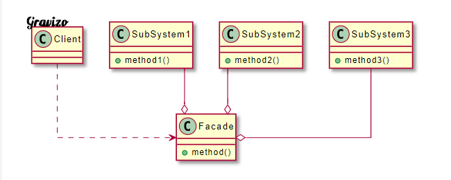

# 為子系統中的一組接口提供一個統一的高層接口，使得子系統更容易使用

| 成員      | 功用                                       |
|-----------|--------------------------------------------|
| Facade    | 為多個SubSystem對外提供的一個接口。        |
| SubSystem | 系統各種不同的功能，Client透過Facade使用。 |

