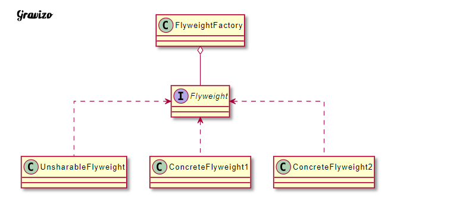
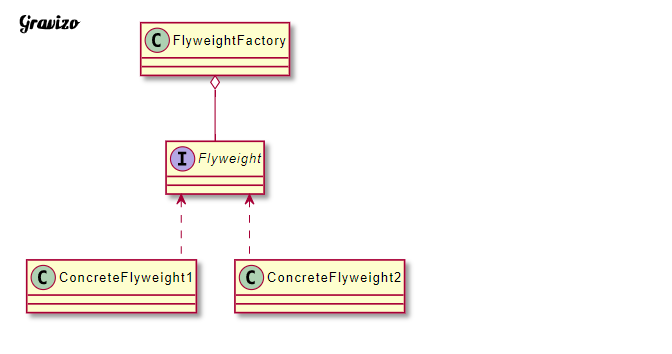
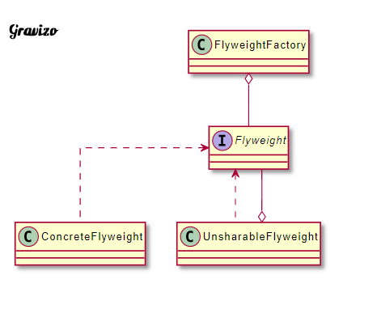

# 運用共享技術有效地支持大量細粒度的物件

內部狀態
不會隨著環境改變而產生變化，所以內部狀態是可以共享的部分。

外部狀態
會隨著環境改變而產生變化的部分，故這部分不可共享。

享元物件的外部狀態必須由Client保存。享元物件建立之後，在需要使用時將其傳入享元物件的內部。外部狀態之間是互相獨立的。

| 成員                | 功用                                                                                                                             |
|---------------------|----------------------------------------------------------------------------------------------------------------------------------|
| Flyweight           | 為介面或抽象類別的接口，其中定義ConcreteFlyweight的方法，非享元的外部狀態以參數的形式通過方法傳入。                              |
| ConcreteFlyweight   | 實現Flyweight                                                                                                                    |
| UnsharableFlyweight | 稱作複合享元物件，不可共享。但可分解成多個單純享元物件，則可共享。                                                               |
| FlyweightFactory    | 負責建立及管理享元物件。當Client呼叫享元物件時，FlyweightFactory檢查是否存在符合要求的物件，存在則提供，不存在建立新的享元物件。 |

剛剛在介紹成員時有提到可以共享與不可以共享的部分，因為這樣，在實作中享元模式又分成單純享元模式以及複合享元模式。

單純享元模式
所有實體享元物件都是可以共享的，不存在UnsharableFlyweight。

複合享元模式
將單純享元物件使用組合形成複合享元物件，此物件不可共享。但若將其分解成單純享元物件，則可以。複合享元物件可對多個單純享元物件設定相同的外部狀態。

