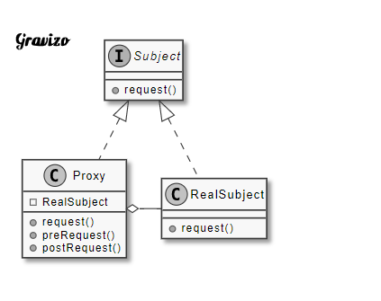

# 爲其他物件提供一種代理以控制對這個物件的訪問。

| 成員        | 功用                                                                                      |
|-------------|-------------------------------------------------------------------------------------------|
| Subject     | 定義RealSubject和Proxy實作的業務方法，可是介面或抽象類別。                                |
| RealSubject | 實作Subject中的方法，為最終要引用的物件。                                                 |
| Proxy       | 提供與RealSubject相同的接口，內部引用RealSubject，可以訪問、控制或擴充RealSubject。 |

Subject：定義代理的方法。
RealSubject：被代理者。
Proxy：代理者。

